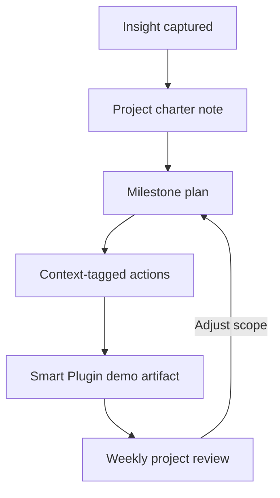

- [ ] Launch marketing site
- [ ] Prepare quarterly review deck
- [ ] Redesign onboarding flow
- [ ] Implement server logging system

## HOW
#### Felt problem, JTBD, and the dramatic question
- Projects sprawl because Smart Plugin discoveries spark parallel efforts without a home.
- Job-to-be-done: "Group related next actions into compelling demo-ready progress arcs."
- Dramatic question: Will this vault show a supporter how multiple Smart Plugins ladder into a shipped result?
- Pain now: Hard to explain how tunnel server, marketing pages, and onboarding scripts reinforce each other.
- Stakes if unchanged: Stakeholders doubt Smart Plugins can manage multi-step outcomes.
- Prize if this works: Repeatable storyboards for Ops, Marketing, and Product demos.
- Relatable friction: The "Launch marketing site" project touches six folders with no single orchestrator note.
- Before snapshot: Projects live in memory and scattered meeting docs.
- After snapshot: Each project has scope, milestones, and plugin dependencies captured here.
- GTD horizon link: Bridges Horizon 1 actions with Horizon 3 areas.
- Hook to common struggle: Obsidian users rarely show how atomic notes roll up into wins.
- One-sentence version: Smart Plugins-backed initiatives with clear definitions of done.

#### Decisive choice, first principles, and boundaries
- Decisive choice: Promote anything needing >1 step into a dedicated project brief.
- First principles: Projects require an outcome statement, success metric, and closure ritual.
- Method boundary: Use `project_status` YAML field (`seed`, `active`, `waiting`, `done`).
- Key definitions: Milestones map to key plugin automations or deliverables.
- Key term boundaries: Experiments stay in incubator unless they graduate into supporter value.
- Concrete examples: "Implement server logging system" splits into auth audit trail, CLI export, analytics share-out.
- Tradeoffs: More structure may slow rapid tests but ensures teachable loops.
- Anti-goals: Avoid turning this into a generic project management board.
- Required inputs: Charter snippet, stakeholders, plugin stack, review cadence.
- Constraints: Each project note must link to at least one Smart Plugin capability.
- Beliefs that justify choice: Demos resonate when narrative arcs show handoffs.
- Non-fit cases: External vendor projects tracked in third-party tools.
- GTD horizon link: Connects Horizon 2 outcomes to Horizon 4 goals like supporter expansion.
- Success criteria: Project briefs show `project_status: active` with dated milestone checkboxes.

#### Causal map and second and third order effects
- Cause chain: Capture initiative → Charter project → Map milestones → Assign contexts → Review progress.
- Key levers: Weekly milestone review and plugin dependency logs.
- Second-order wins: Product marketing sees how Smart Plugins accelerate delivery.
- Second-order risks: Overcommitting to too many active projects dilutes focus.
- Third-order externalities: Supporters borrow templates and replicate success.
- Debts or maintenance costs: Stale milestones mislead demos about progress.
- Contrasting failed paths: Deliverables tracked only in chat threads.
- Ladder of abstraction: Task-level evidence feeding into strategic OKRs.
- Early signals: `active` projects drop below three concurrently and finish regularly.
- Measurable metrics: Milestone completion rate, average project duration, plugin coverage count.
- Falsifiable assumptions: If outcomes slip despite structured briefs, resourcing or scope is unclear.
- GTD bridge: Keeps horizon review anchored to tangible supporter value.

#### Playbook, agency metrics, and stop conditions
- Pattern name: Smart Vault project charter loop.
- Minimal loop: Charter → Milestone planning → Weekly review → Demo artifact.
- Checkable steps: Define outcome, link plugin dependencies, assign owners, review notes.
- Needed templates: `smart-templates/default/project.md` with status, metrics, and dependencies sections.
- Local-first instructions: Store milestone history inside the markdown note using dataview-compatible tables.
- File-over-app notes: Keep attachments (mockups, exports) in adjacent folders with relative links.
- Agency metrics: Percent of milestones linked to Smart Plugin automations.
- Stop conditions: Archive or renegotiate when progress stalls for two consecutive reviews.
- Definition of done: Outcome delivered, retrospective logged, status flipped to `done` with date.
- Reuse paths across tools: Export charter summary to Linear/Jira if a cross-team push emerges.
- Community reciprocity steps: Publish sanitized charters to supporters as case studies.
- Credits and sources: [[🧩 Smart Plugins]], Smart Server logs, supporter interviews, GTD Horizons.
- GTD link: Reviews schedule ties into `review.md` weekly ritual block.

#### Visual and narrative execution plan
- McKee beats: Setup (ambiguous initiative) → Complications (scope creep) → Climax (plugin-assisted breakthrough) → Resolution (delivered milestone).
- First-person lines: "Each project brief shows which Smart Plugin saved us time this week."
- Pattern interrupt: Reveal dataview board flipping from idea backlog to active-in-progress.
- Single visual metaphor: Control tower monitoring flights (projects) with Smart Plugin instrumentation.
- Literal visualization: Dataview board grouping by `project_status`.
- Whiteboard sketch moments: Draw plugin dependency map for the primary milestone.
- High-impact visuals: Overlay Smart Server audit logs when demonstrating completion.
- Dramatization moments: Fast-forward clips of milestone check-ins over 30 days.
- B-roll, graphics, and captures: Terminal session triggering CLI tasks, Obsidian backlink explorer, supporter email preview.
- Eye contact and posture cues: Stand while narrating milestone celebration to inject energy.
- Wardrobe and background choices: Crisp, professional look when pitching supporter outcomes.
- On-screen text and lower thirds: Display milestone names and status transitions.
- Post-production polish beats: Use motion graphics to trace dependency edges.
- Measured call to action: Encourage viewers to duplicate the charter template for their next release.
- Calendar blocks for execution: Monday charter review, Wednesday progress sync, Friday demo dry run.
- 70 percent eye contact look: Alternate between camera and screen during milestone walkthrough.
- Open palms and relaxed shoulders signal: Communicate confidence in the repeatable system.
- Straw hat and shirt cue evoke: Optional nod when discussing long-term supporter relationships.
