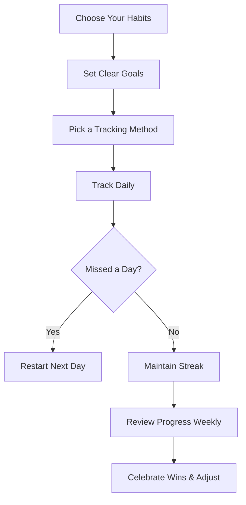

### Summary
Habit tracking involves recording and monitoring daily behaviors to maintain consistency and build habits. It offers visual proof of progress, motivating users to sustain streaks. The process includes selecting key habits, setting clear goals, choosing a tracking method, and recording progress routinely. Tools range from apps to paper trackers and spreadsheets, each suited to different preferences. It’s important to stay resilient despite occasional missed days, avoid overloading with too many habits, and maintain motivation by celebrating milestones.

### Key Points
- Habit tracking records daily behavior to build consistency.
- Visual progress helps maintain motivation and streaks.
- Start with a small number of habits and clear daily goals.
- Track progress using digital apps, paper, or spreadsheets.
- If a day is missed, restart without discouragement.
- Focus on important habits to prevent burnout.
- Use weekly reviews and habit stacking to improve success.

### Chart
