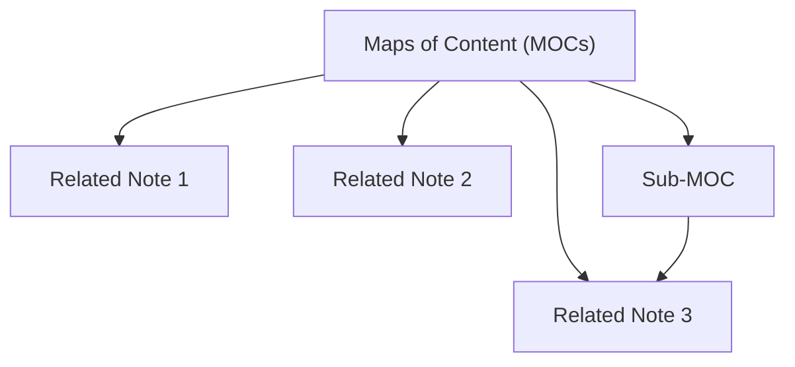

## Overview of LYT
Linking Your Thinking (LYT) is a framework for organizing knowledge using Maps of Content (MOCs) and linking between notes.

## Concept of Maps of Content (MOCs)
MOCs are central hubs that link to related notes, creating a hierarchical structure that is easy to navigate.

## LYT Kits and Vaults
LYT offers pre-made templates and systems for organizing notes and ideas in a digital vault.

## Linking Notes in LYT
- Use bidirectional links to create relationships between concepts.
- Link ideas contextually, so each note has meaningful connections.

## Benefits of LYT Approach
- Helps create a knowledge system that reflects personal thinking patterns.
- Encourages creativity by visualizing connections between ideas.

“Linking Your Thinking” aligns perfectly with Smart Vault methods. This note demonstrates how idea emergence and networked thinking are amplified by Smart Connections.

## Behavior
The user runs “Idea Expansion” via Smart Chat, and the resulting note links are autoconnected to thought trails or maps of content.

## Takeaway
Smart Ecosystem tools operationalize LYT principles—making links appear when they matter most, and helping thoughts form into systems.

Linking is what turns your notes from a storage box into a thinking system.

### 🧠 Why It Matters
- Shows how ideas relate
- Surfaces unexpected insights
- Creates a network you can explore and expand

### 🛠️ Smart Linking Habits
- Link when reviewing, not while capturing
- Use both forward and backward links
- Add context: why is this note connected?

### 🔗 Related Notes
- [[Tagging and Linking]]
- [[Zettelkasten Method]]
- [[Synthesis of Information]]
- [[Relationships Between Concepts]]

### ✅ Try This
Open a recent note. Add two links:
1. One upstream (where did this idea come from?)
2. One downstream (where can it be applied?)

That’s the start of a living thought web.

