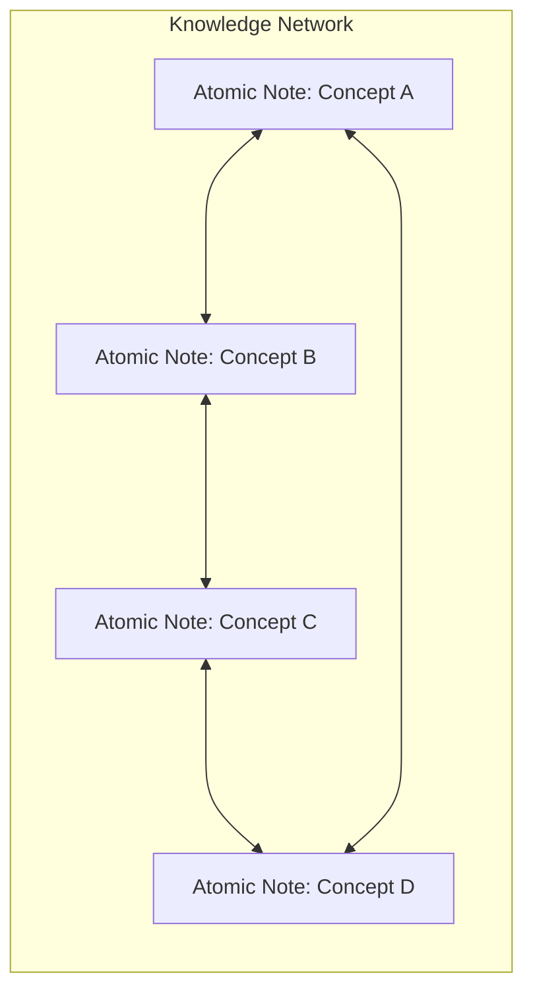

- Ensure every new note is linked to relevant existing notes.
- Use bidirectional links to create a web of knowledge.
- Atomic notes are individual, self-contained units of thought that represent a single concept or idea.
- They can be easily linked, updated, and rearranged without losing context.
- This modularity enables flexible knowledge structures that evolve over time.

Atomic notes are self-contained units of thought that can be easily linked and rearranged.

This is where knowledge turns into insight.

A well-structured system of atomic notes connected through bidirectional links fosters deep understanding and creative thinking. By constantly linking and revising notes, you map out the relationships between concepts, making your knowledge both accessible and expandable.

### Purpose
- Connect related ideas across domains
- Build a web of knowledge, not a pile of notes
- Enable easy navigation and discovery of insights by following links between concepts
- Support incremental learning through adding and refining atomic notes over time

### Tips
- Link ideas, not just words
- Use forward and backward links

