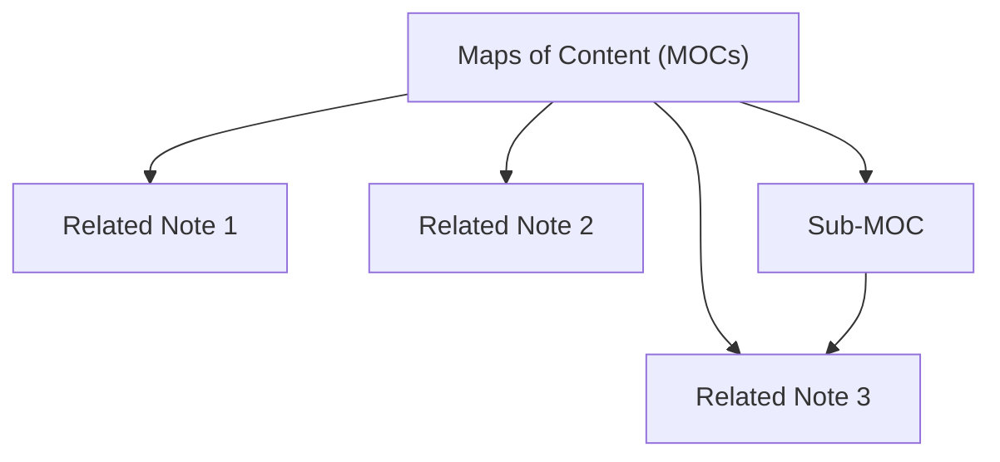

> [!summary]
> LYT approach: Maps of Content plus contextual linking to mirror how you think.

> [!When to use]
> If your vault feels like filing and not thinking, this note shows how to use links and MOCs to mirror your reasoning, without rigid folders.

### LYT mental model and purpose
- Your vault should mirror how you think and navigate, not how a library shelves books.
- Reduce friction when you do not remember exact titles.
- Provide curated entry points into clusters of notes.
- Encourage linking that builds trails of thought, not just lists.

### MOCs as the primary navigation layer
- Is curated (the best entry points, not everything).
- Has a short reading path (beginner -> advanced).
- Links with context ("start here", "use when").
- Do not paste content into a MOC. Link to the atomic notes instead.

### Linking rules that reflect thinking patterns
- Building a dense graph with no context. Fix: apply the standards in [[Tag Canon]] and relationship sentences.
- Link when you make a claim that depends on another note.
- For important links, add one sentence that explains the relationship (not just the link).
- Prefer 1-3 meaningful links over 10 generic ones.

### Templates and kit concepts
- templates,
- checklists,
- queries,
- and a MOC.

### When to use LYT vs folders vs tags
- MOCs when you need curated navigation and thinking trails.
- Folders when you need storage boundaries (inbox vs archive).
- Tags when you need grouping and review queues.
- Keep "references/" as a folder boundary.

## Next action
Pick one note you touched this week and upgrade it using this note's main rule (1 pass only).

## Overview of LYT
Linking Your Thinking (LYT) is a framework for organizing knowledge using Maps of Content (MOCs) and linking between notes.

## Concept of Maps of Content (MOCs)
MOCs are central hubs that link to related notes, creating a hierarchical structure that is easy to navigate.

## LYT Kits and Vaults
LYT offers pre-made templates and systems for organizing notes and ideas in a digital vault.

## Linking Notes in LYT
- Use bidirectional links to create relationships between concepts.
- Link ideas contextually, so each note has meaningful connections.

## Benefits of LYT Approach
- Helps create a knowledge system that reflects personal thinking patterns.
- Encourages creativity by visualizing connections between ideas.

“Linking Your Thinking” aligns perfectly with Smart Vault methods. This note demonstrates how idea emergence and networked thinking are amplified by Smart Connections.

## Behavior
The user runs “Idea Expansion” via Smart Chat, and the resulting note links are autoconnected to thought trails or maps of content.

## Takeaway
Smart Ecosystem tools operationalize LYT principles—making links appear when they matter most, and helping thoughts form into systems.

Linking is what turns your notes from a storage box into a thinking system.

### 🧠 Why It Matters
- Shows how ideas relate
- Surfaces unexpected insights
- Creates a network you can explore and expand

### 🛠️ Smart Linking Habits
- Link when reviewing, not while capturing
- Use both forward and backward links
- Add context: why is this note connected?

### 🔗 Related Notes
- [[Tagging and Linking]]
- [[reference/PKM/Zettelkasten Method]]
- [[Synthesis of Information]]
- [[Relationships Between Concepts]]

### ✅ Try This
Open a recent note. Add two links:
1. One upstream (where did this idea come from?)
2. One downstream (where can it be applied?)

That’s the start of a living thought web.

